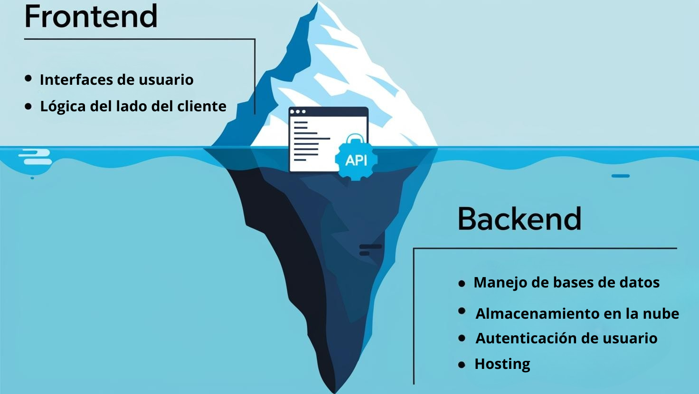
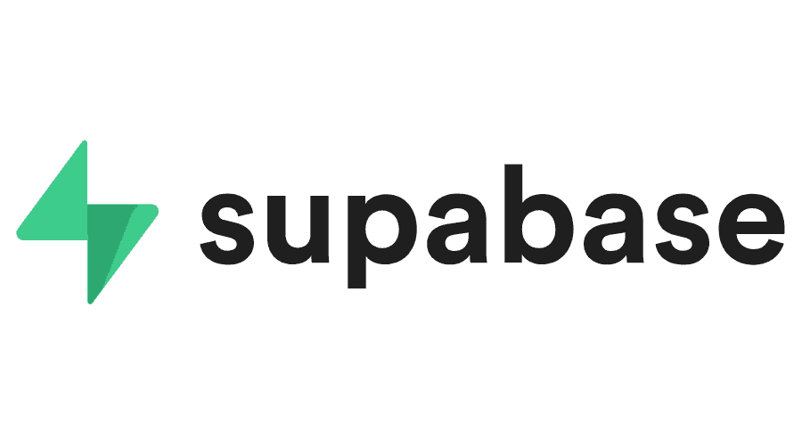
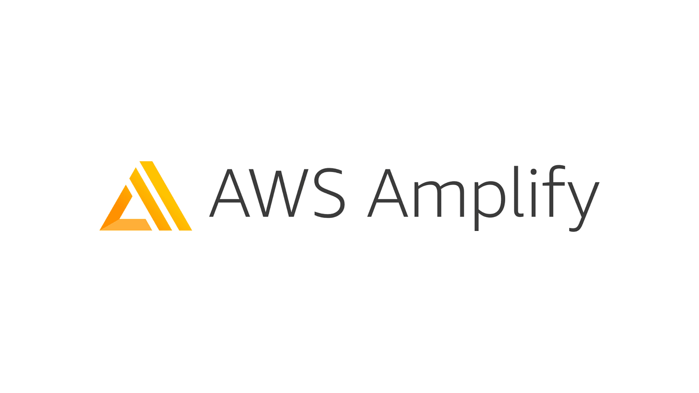

# **¿A qué se le llama Backend as a Service (BaaS)?**

## **Definición de BaaS** 📕

Backend-as-a-Service (BaaS) es un modelo de servicio en la nube que permite a los desarrolladores **externalizar las funciones** del **backend** y **centrarse únicamente** en el **frontend**. 

Los proveedores de BaaS ofrecen soluciones ya configuradas para gestionar en el servidor tareas como la autenticación, la administración de bases de datos, actualizaciones remotas, notificaciones push, así como el almacenamiento y alojamiento en la nube [1].

## **Diferencias entre BaaS, PaaS y SaaS** 🪞

- **BaaS**: Se centra en proporcionar servicios de backend como bases de datos, autenticación y almacenamiento.
- **PaaS**: Proporciona una plataforma completa para desarrollar, ejecutar y gestionar aplicaciones sin preocuparse por la infraestructura subyacente.
- **SaaS**: Ofrece aplicaciones completas a través de internet, como CRM o software de contabilidad.

   

## **Servicios Backend as a Service (BaaS)** 📋

1️⃣ **Firebase** 📌

   ✅ **Autenticación**, bases de datos en tiempo real y almacenamiento en la nube.
    
   ✅ Ideal para apps móviles y web.

   { .center-image }

2️⃣ **Supabase** 📌

   ✅ Alternativa open-source a Firebase con PostgreSQL y autenticación integrada.  

   ✅ Recomendado para proyectos que necesitan flexibilidad.  
   { .center-image }

3️⃣ **Appwrite** 📌  

   ✅ Herramientas para autenticación, bases de datos y almacenamiento de archivos. 

   ✅ Compatible con múltiples lenguajes (JavaScript, Python, etc.).
   { .center-image }

4️⃣ **Back4App** 📌  

   ✅ Basado en Parse, permite crear backends sin código.  

   ✅ Útil para aplicaciones complejas.
   { .center-image }

5️⃣ **AWS Amplify** 📌

   ✅ Servicio de Amazon para apps escalables con autenticación y APIs.  
   
   ✅ Integrado con servicios AWS como S3 y Lambda.
   { .center-image }

