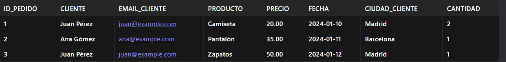
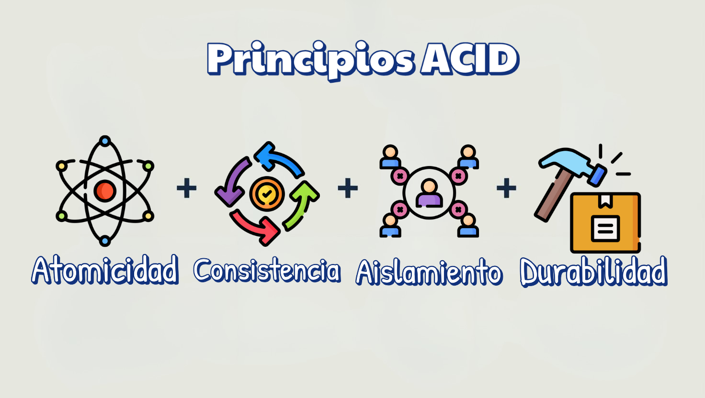

# **Conceptos de Base de Datos Relacional**

Al utilizar Supabase —que se basa en PostgreSQL—, es fundamental comprender y aplicar varios conceptos clásicos de bases de datos relacionales para garantizar la eficiencia, integridad y escalabilidad de las aplicaciones. A continuación se detallan algunos de los conceptos clave a considerar:

## **Modelo Relacional y Normalización** 📊⚙️

Organizar los datos en tablas relacionadas y aplicar técnicas de normalización (por ejemplo, hasta la tercera forma normal) ayuda a minimizar la redundancia y mantener la coherencia de los datos. La correcta estructura relacional facilita consultas más sencillas y evita inconsistencias [14].

➡️ **Ejemplo**

Datos No Normalizados (Tabla Inicial)

Supongamos una tabla **pedidos** que almacena información de ventas:

   

➡️ **Problemas:**

**Redundancia:** Datos del cliente (email, ciudad) se repiten en múltiples pedidos.

**Anomalías:** Si Juan Pérez cambia de ciudad, hay que actualizar múltiples registros.

**Dependencias parciales/transitivas:** El Precio depende del Producto, no del ID_Pedido.

1️⃣ **Primera Forma Normal (1FN): Valores Atómicos**

**Requisito:** Todas las columnas deben tener valores atómicos (sin listas ni datos compuestos).

En este caso, la tabla ya cumple 1FN porque cada celda tiene un solo valor.

2️⃣ **Segunda Forma Normal (2FN): Eliminar Dependencias Parciales**

**Requisito:** Todas las columnas no clave deben depender completamente de la clave primaria.

**Problema:**

🔹La clave primaria compuesta podría ser (ID_Pedido, Producto), pero:

 🔸Precio depende solo de Producto.

 🔸Cliente, Email_Cliente, y Ciudad_Cliente dependen solo de ID_Pedido.

 **Solución:** 

 Dividir en tablas.

**Tabla clientes**

    CREATE TABLE clientes (
        id_cliente INT PRIMARY KEY AUTO_INCREMENT,
        nombre VARCHAR(100),
        email VARCHAR(100) UNIQUE,
        ciudad VARCHAR(100)
    );

**Tabla productos**

    CREATE TABLE productos (
        id_producto INT PRIMARY KEY AUTO_INCREMENT,
        nombre VARCHAR(100),
        precio DECIMAL(10, 2)
    );

**Tabla pedidos**

    CREATE TABLE pedidos (
        id_pedido INT PRIMARY KEY AUTO_INCREMENT,
        id_cliente INT,
        fecha DATE,
        FOREIGN KEY (id_cliente) REFERENCES clientes(id_cliente)
    );

**Tabla detalle_pedidos**

    CREATE TABLE detalle_pedidos (
        id_pedido INT,
        id_producto INT,
        cantidad INT,
        PRIMARY KEY (id_pedido, id_producto),
        FOREIGN KEY (id_pedido) REFERENCES pedidos(id_pedido),
        FOREIGN KEY (id_producto) REFERENCES productos(id_producto)
    );

3️⃣ **Tercera Forma Normal (3FN): Eliminar Dependencias Transitivas**

**Requisito:** Eliminar atributos que dependan de otros atributos no clave.

Problema en **clientes:**

🔹Ciudad_Cliente depende de id_cliente, pero podría haber redundancia si muchos clientes comparten la misma ciudad.

**Solución:** Separar ciudades en una tabla independiente (opcional, pero útil para evitar duplicados):

**Tabla ciudades**

    CREATE TABLE ciudades (
        id_ciudad INT PRIMARY KEY AUTO_INCREMENT,
        nombre VARCHAR(100) UNIQUE
    );

**Tabla clientes (actualizada)**

    CREATE TABLE clientes (
        id_cliente INT PRIMARY KEY AUTO_INCREMENT,
        nombre VARCHAR(100),
        email VARCHAR(100) UNIQUE,
        id_ciudad INT,
        FOREIGN KEY (id_ciudad) REFERENCES ciudades(id_ciudad)
    );

**Estructura Final Normalizada (3FN)**

1️⃣ **clientes:** Almacena datos únicos de clientes.

2️⃣ **productos:** Gestiona información de productos.

3️⃣ **pedidos:** Relaciona clientes con pedidos.

4️⃣ **detalle_pedidos:** Detalla productos por pedido.

5️⃣ **ciudades:** Evita duplicar nombres de ciudades.

➡️ **Ejemplo de Inserción de Datos**

    -- Insertar ciudades
    INSERT INTO ciudades (nombre) VALUES ('Madrid'), ('Barcelona');

    -- Insertar clientes
    INSERT INTO clientes (nombre, email, id_ciudad)
    VALUES ('Juan Pérez', 'juan@example.com', 1),
        ('Ana Gómez', 'ana@example.com', 2);

    -- Insertar productos
    INSERT INTO productos (nombre, precio)
    VALUES ('Camiseta', 20.00),
        ('Pantalón', 35.00),
        ('Zapatos', 50.00);

    -- Insertar pedidos
    INSERT INTO pedidos (id_cliente, fecha) VALUES (1, '2024-01-10'), (2, '2024-01-11'), (1, '2024-01-12');

    -- Detalle de pedidos
    INSERT INTO detalle_pedidos (id_pedido, id_producto, cantidad)
    VALUES (1, 1, 2),  -- Pedido 1: 2 camisetas
        (2, 2, 1),  -- Pedido 2: 1 pantalón
        (3, 3, 1);  -- Pedido 3: 1 zapato

**Ventajas de la Normalización**

🔹 **Menos redundancia:** Datos como email o precio no se repiten.

🔹 **Integridad:** Actualizar una ciudad en ciudades afecta a todos los clientes relacionados.

🔹 **Consultas eficientes:** JOINs sencillos entre tablas.

Ejemplo de consulta para obtener todos los pedidos de Juan Pérez:

    SELECT p.id_pedido, pr.nombre AS producto, d.cantidad, pr.precio
    FROM pedidos p
    JOIN clientes c ON p.id_cliente = c.id_cliente
    JOIN detalle_pedidos d ON p.id_pedido = d.id_pedido
    JOIN productos pr ON d.id_producto = pr.id_producto
    WHERE c.nombre = 'Juan Pérez';
        
## **Claves Primarias y Foráneas** 🔑🔗

Las claves primarias identifican de forma única cada registro de una tabla, mientras que las claves foráneas establecen las relaciones entre tablas, permitiendo que la integridad referencial se mantenga en el sistema. Esto es crucial para garantizar que las relaciones entre los distintos conjuntos de datos sean válidas.

➡️ **Ejemplo: Tabla de Usuarios**

Supongamos una tabla llamada **usuarios** que almacena información de usuarios:

    CREATE TABLE usuarios (
        user_id INT PRIMARY KEY,       -- Clave primaria
        email VARCHAR(100) UNIQUE,     -- Clave secundaria (candidata)
        nombre VARCHAR(50),
        telefono VARCHAR(15) UNIQUE    -- Otra clave secundaria (candidata)
    );

➡️ **Ejemplo de uso:**

    -- Insertar un usuario (user_id es obligatorio y único)
    INSERT INTO usuarios (user_id, email, nombre, telefono)
    VALUES (1, 'juan@example.com', 'Juan', '123-456-789');

    -- Esto fallaría (user_id duplicado):
    INSERT INTO usuarios (user_id, email, nombre) 
    VALUES (1, 'maria@example.com', 'María'); 

    -- Esto también fallaría (email duplicado):
    INSERT INTO usuarios (user_id, email, nombre) 
    VALUES (2, 'juan@example.com', 'María');

## **Restricciones (Constraints)** 🚫✋🏼

El uso de restricciones como **UNIQUE**, **NOT NULL**, **CHECK** y **PRIMARY KEY** es vital para asegurar la validez y precisión de los datos almacenados. Estas restricciones ayudan a prevenir la inserción de datos erróneos o inconsistentes.

**Ejemplo de Restricciones en SQL**

    -- Crear una tabla de usuarios con restricciones
    CREATE TABLE usuarios (
        id_usuario INT PRIMARY KEY AUTO_INCREMENT,  -- Clave primaria única y autoincremental
        nombre VARCHAR(50) NOT NULL,                -- No permite valores nulos
        email VARCHAR(100) UNIQUE NOT NULL,         -- Debe ser único y no nulo
        edad INT CHECK (edad > 0),                 -- Edad debe ser mayor a 0
        rol VARCHAR(20) DEFAULT 'usuario'          -- Valor por defecto y restricción de valores
            CHECK (rol IN ('admin', 'editor', 'usuario'))
    );

**Explicación de las restricciones:**

1️⃣ **PRIMARY KEY** (id_usuario):

🔹Identifica cada registro de forma única.

🔹No permite valores duplicados ni NULL.

🔹Autoincremental: Genera un ID automáticamente al insertar un nuevo usuario.

2️⃣ **NOT NULL** (nombre, email):

🔹Obliga a que estos campos siempre tengan un valor .

🔹Ejemplo: No puedes insertar un usuario sin nombre o email.

3️⃣ **UNIQUE** (email):

🔹Asegura que no haya emails duplicados en la tabla.

🔹Si intentas registrar el mismo email dos veces, la base de datos lanzará un error.

4️⃣ **CHECK** (edad > 0):

🔹Valida que la edad sea un número positivo.

🔹Ejemplo: edad = -5 generaría un error.

5️⃣ **CHECK + DEFAULT** (rol):

🔹Define valores permitidos para rol (solo 'admin', 'editor' o 'usuario').

🔹Si no se especifica un rol, se asigna 'usuario' por defecto.

## **Integridad Referencial** 🫱🏾‍🫲🏼🧩

Se debe asegurar mediante el uso de claves foráneas que los datos relacionados sean consistentes entre sí. Esto previene, por ejemplo, que se elimine un registro de una tabla padre cuando existen registros relacionados en una tabla hija, a menos que se establezca una acción en cascada.

➡️ **Ejemplo: Clientes y Pedidos**

Supongamos dos tablas: clientes (padre) y pedidos (hija).

La tabla pedidos tendrá una clave foránea que referencia a clientes.

1️⃣ Crear tabla **clientes (padre)**:

        CREATE TABLE clientes (
            id_cliente INT PRIMARY KEY AUTO_INCREMENT,
            nombre VARCHAR(50) NOT NULL
        );

2️⃣ Crear tabla **pedidos (hija)** con clave foránea:

    CREATE TABLE pedidos (
        id_pedido INT PRIMARY KEY AUTO_INCREMENT,
        descripcion VARCHAR(100),
        id_cliente INT,
        FOREIGN KEY (id_cliente) 
            REFERENCES clientes(id_cliente)
            ON DELETE CASCADE  -- Acción en cascada al eliminar
            ON UPDATE CASCADE  -- Acción en cascada al actualizar
    );

**Explicación de las acciones:**

🔹**FOREIGN KEY (id_cliente):**

🔸La columna id_cliente en pedidos debe existir en la tabla clientes.

🔸Esto evita que se inserten pedidos con un id_cliente inválido.

🔹**ON DELETE CASCADE:**

🔸Si se elimina un cliente de la tabla clientes, todos sus pedidos se eliminan automáticamente.

🔸Esto mantiene la consistencia: no habrá pedidos "huérfanos".

🔹**ON UPDATE CASCADE:**

🔸Si se actualiza el id_cliente en la tabla clientes, los cambios se propagan automáticamente a la tabla pedidos.

➡️ **Ejemplos de operaciones**

Inserción válida:

    -- Insertar un cliente
    INSERT INTO clientes (nombre) VALUES ('Juan Pérez');

    -- Insertar un pedido vinculado al cliente (id_cliente = 1)
    INSERT INTO pedidos (descripcion, id_cliente) 
    VALUES ('Pedido de camiseta', 1);  -- ¡Válido!

Inserción inválida (falla por integridad referencial):

    -- Intentar insertar un pedido con id_cliente = 99 (no existe)
    INSERT INTO pedidos (descripcion, id_cliente) 
    VALUES ('Pedido inválido', 99);  -- Error: No se puede insertar.

Eliminación con cascada:

    -- Eliminar al cliente con id_cliente = 1
    DELETE FROM clientes WHERE id_cliente = 1;

    -- Resultado: 
    -- - El cliente se elimina de `clientes`.
    -- - Todos sus pedidos se eliminan automáticamente de `pedidos`.

Actualización con cascada:

    -- Actualizar el id_cliente de Juan Pérez (de 1 a 100)
    UPDATE clientes SET id_cliente = 100 WHERE id_cliente = 1;

    -- Resultado: 
    -- - El cliente ahora tiene id_cliente = 100.
    -- - Los pedidos asociados también actualizan su `id_cliente` a 100.

➡️ **¿Qué sucede sin integridad referencial?**

Si no existiera la clave foránea:

🔹Podrías insertar pedidos con id_cliente inexistente.

🔹Al eliminar un cliente, sus pedidos quedarían "huérfanos" (inconsistentes).

## **Transacciones y Cumplimiento de las Propiedades ACID** 🥇🥈

Las transacciones son un pilar fundamental en sistemas de bases de datos relacionales, ya que garantizan que operaciones complejas se ejecuten de manera confiable y segura , incluso en entornos con múltiples usuarios o procesos concurrentes. Las propiedades **ACID (Atomicidad, Consistencia, Aislamiento y Durabilidad)** son el marco que asegura esta confiabilidad.

   

➡️ **¿Por qué ACID es crucial en sistemas reales?**

🔹**Operaciones complejas:**

En aplicaciones como banca, e-commerce o IoT, donde operaciones multietapa (ej: reservar un producto, descontar inventario, generar factura) deben ser indivisibles.

🔹**Entornos concurrentes:**

En sistemas con múltiples usuarios o dispositivos IoT actualizando datos simultáneamente, el aislamiento evita inconsistencias.

🔹**Recuperación ante fallos:**

La durabilidad garantiza que, incluso después de un desastre, los datos estén intactos y recuperables.

➡️ **Consecuencias de Ignorar ACID**

🔹**Inconsistencia:** 

Datos corruptos o violaciones de reglas de negocio.

🔹**Pérdida de datos:**

 Cambios no guardados tras un fallo.

🔹**Condiciones de carrera:** 

Resultados impredecibles en sistemas concurrentes.

➡️ **ACID en Tecnologías Modernas**

**Bases de datos relacionales (MySQL, PostgreSQL):** 

🔹Cumplen ACID por diseño.

**Bases de datos NoSQL:** 

🔹Algunas (ej: MongoDB) ofrecen ACID parcial o en transacciones limitadas.

**IoT y sistemas distribuidos:** 

🔹Herramientas como Supabase o CockroachDB implementan ACID para garantizar coherencia en datos distribuidos.

¡Las propiedades ACID son la base para construir sistemas robustos y confiables! 

## **Índices** 🔍🔖

La creación de índices sobre las columnas más consultadas mejora significativamente el rendimiento de las consultas, facilitando búsquedas y operaciones JOIN en grandes volúmenes de datos. Sin embargo, se debe equilibrar el número de índices ya que un exceso puede afectar el rendimiento de las operaciones de escritura.

➡️ **Ejemplo: Tabla usuarios**

Supongamos una tabla con información de usuarios:

    CREATE TABLE usuarios (
        id_usuario INT PRIMARY KEY AUTO_INCREMENT,
        nombre VARCHAR(50),
        email VARCHAR(100),
        fecha_registro DATE
    );

1️⃣ **Crear un índice en una columna frecuentemente consultada**

En caso de realizar muchas búsquedas por email, crear un índice acelerará estas consultas:

    -- Crear un índice en la columna 'email'
    CREATE INDEX idx_email ON usuarios(email);

**Beneficio:**

🔹La consulta **SELECT * FROM usuarios WHERE email = 'juan@example.com';** será más rápida , ya que el índice permite buscar el valor directamente, en lugar de escanear toda la tabla

2️ **Índice compuesto para consultas con múltiples columnas**

Si se suele filtrar por nombre y fecha_registro al mismo tiempo:

    -- Crear un índice compuesto en 'nombre' y 'fecha_registro'
    CREATE INDEX idx_nombre_fecha ON usuarios(nombre, fecha_registro);

**Beneficio:**

🔹La consulta **SELECT * FROM usuarios WHERE nombre = 'Juan' AND fecha_registro > '2023-01-01';** usará este índice para mayor eficiencia.

3️⃣ **¿Cuándo evitar índices?**

🔹En columnas con pocos valores únicos (ej: género: 'M'/'F'), ya que el índice no aporta ventajas.

🔹En tablas con muchas escrituras (INSERT/UPDATE/DELETE) , ya que los índices ralentizan estas operaciones (el motor debe actualizar el índice cada vez).

4️⃣ **Eliminar un índice innecesario**

Si un índice no se usa o perjudica el rendimiento, es posible eliminarlo:

    DROP INDEX idx_nombre_fecha ON usuarios;    

## **Consultas SQL y Vistas** 📜❓

Comprender el lenguaje SQL es esencial para definir consultas más eficientes. Asimismo, el uso de vistas (views) permite encapsular lógica de consulta compleja, simplificando el acceso a conjuntos de datos predefinidos y mejorando la seguridad mediante la exposición limitada de la estructura subyacente.

**Ejemplo: Gestión de Ventas**

Supongamos una base de datos con dos tablas: **productos** y **ventas**.

1️⃣ Crear tablas:

    -- Tabla de productos
    CREATE TABLE productos (
        id_producto INT PRIMARY KEY,
        nombre VARCHAR(50),
        precio DECIMAL(10,2)
    );

    -- Tabla de ventas
    CREATE TABLE ventas (
        id_venta INT PRIMARY KEY,
        id_producto INT,
        cantidad INT,
        fecha DATE,
        FOREIGN KEY (id_producto) REFERENCES productos(id_producto)
    );

2️⃣ **Insertar datos de ejemplo:**

    -- Productos
    INSERT INTO productos VALUES 
    (1, 'Camiseta', 20.00),
    (2, 'Pantalón', 35.00);

    -- Ventas
    INSERT INTO ventas VALUES 
    (101, 1, 2, '2024-01-10'),
    (102, 2, 1, '2024-01-11');

3️⃣ **Consulta SQL compleja**

Supongamos que queremos un reporte de ventas con el **total ganado por producto**:

    SELECT 
        p.nombre AS producto,
        SUM(v.cantidad) AS total_vendido,
        SUM(p.precio * v.cantidad) AS ingresos_totales
    FROM ventas v
    JOIN productos p ON v.id_producto = p.id_producto
    GROUP BY p.nombre;

**Resultado:**

    | producto  | total_vendido | ingresos_totales |
    |-----------|---------------|------------------|
    | Camiseta  | 2             | 40.00            |
    | Pantalón  | 1             | 35.00            |

4️⃣ **Crear una vista para simplificar**

La consulta anterior es útil, pero repetitiva. Podemos encapsularla en una vista:

    CREATE VIEW reporte_ventas AS
    SELECT 
        p.nombre AS producto,
        SUM(v.cantidad) AS total_vendido,
        SUM(p.precio * v.cantidad) AS ingresos_totales
    FROM ventas v
    JOIN productos p ON v.id_producto = p.id_producto
    GROUP BY p.nombre;

5️⃣ **Usar la vista**

Ahora, en lugar de escribir la consulta completa, simplemente:

    SELECT * FROM reporte_ventas;   

**Beneficios de la vista:**

🔹**Simplifica el acceso:**

Los usuarios no necesitan conocer la lógica interna.

🔹**Seguridad:** 

Puedes otorgar permisos solo a la vista, ocultando las tablas originales.

🔹**Mantenimiento:**

Si cambia la estructura de las tablas, solo se actualiza la vista.

6️⃣ **Ejemplo de seguridad con vistas**

Imaginemos que queremos que un usuario solo vea ventas del 2024 sin acceso a la tabla **ventas**:

    CREATE VIEW ventas_2024 AS
    SELECT * FROM ventas
    WHERE fecha BETWEEN '2024-01-01' AND '2024-12-31';

Ahora, el usuario puede consultar **ventas_2024** sin ver datos anteriores o futuros.

## **Triggers y Procedimientos Almacenados** 💥⛓️

Los triggers permiten ejecutar código de forma automática ante ciertos eventos (como inserciones, actualizaciones o eliminaciones), mientras que los procedimientos almacenados encapsulan la lógica de negocio directamente en la base de datos, lo que puede mejorar el rendimiento y la seguridad al centralizar operaciones críticas.

➡️ **Ejemplo**

Gestionamos una tabla productos y queremos:

1. Auditar cambios de precios usando un trigger.

2. Insertar productos con validación usando un procedimiento almacenado.

1️⃣ **Crear tabla productos**

        CREATE TABLE productos (
            id_producto INT PRIMARY KEY AUTO_INCREMENT,
            nombre VARCHAR(50),
            precio DECIMAL(10, 2),
            stock INT
        );

2️⃣ **Crear tabla de auditoría**

        CREATE TABLE auditoria_precios (
            id_auditoria INT PRIMARY KEY AUTO_INCREMENT,
            id_producto INT,
            precio_anterior DECIMAL(10, 2),
            precio_nuevo DECIMAL(10, 2),
            fecha_cambio TIMESTAMP DEFAULT CURRENT_TIMESTAMP
        );

3️⃣ **Ejemplo de Trigger**

Trigger: Registra cambios de precio en **auditoria_precios** después de una actualización.

        DELIMITER $$

        CREATE TRIGGER tr_actualizar_precio
        AFTER UPDATE ON productos
        FOR EACH ROW
        BEGIN
            IF OLD.precio <> NEW.precio THEN
                INSERT INTO auditoria_precios (id_producto, precio_anterior, precio_nuevo)
                VALUES (OLD.id_producto, OLD.precio, NEW.precio);
            END IF;
        END$$

        DELIMITER;

**¿Qué hace?**

🔹Se activa después de una actualización **(AFTER UPDATE)**.

🔹Compara el precio anterior **(OLD.precio)** con el nuevo **(NEW.precio)**.

🔹Si hay cambios, inserta un registro en **auditoria_precios**.

4️⃣ **Ejemplo de Procedimiento Almacenado**

Procedimiento: Inserta un nuevo producto con validaciones de precio y stock.

        DELIMITER $$

        CREATE PROCEDURE InsertarProducto(
            IN p_nombre VARCHAR(50),
            IN p_precio DECIMAL(10, 2),
            IN p_stock INT
        )
        BEGIN
            -- Validar precio positivo
            IF p_precio <= 0 THEN
                SIGNAL SQLSTATE '45000' 
                    SET MESSAGE_TEXT = 'Error: El precio debe ser mayor a 0';
            END IF;

            -- Validar stock no negativo
            IF p_stock < 0 THEN
                SIGNAL SQLSTATE '45000' 
                    SET MESSAGE_TEXT = 'Error: El stock no puede ser negativo';
            END IF;

            -- Insertar producto si pasa las validaciones
            INSERT INTO productos (nombre, precio, stock)
            VALUES (p_nombre, p_precio, p_stock);
        END$$

        DELIMITER;

**¿Qué hace?**

🔹Recibe parámetros (p_nombre, p_precio, p_stock).

🔹Valida que el precio sea positivo y el stock no negativo.

🔹Si hay errores, lanza un mensaje (SIGNAL SQLSTATE).

🔹Si todo es válido, inserta el producto.

5️⃣ **Uso en la práctica**

Ejecutar el procedimiento almacenado:

    -- Insertar un producto válido
    CALL InsertarProducto('Camiseta', 20.00, 100);

    -- Intentar insertar un producto con precio inválido
    CALL InsertarProducto('Pantalón', -5.00, 50);  -- ¡Falla! (precio negativo)

Ver el trigger en acción:

    -- Actualizar el precio de un producto
    UPDATE productos SET precio = 25.00 WHERE id_producto = 1;

    -- Verificar la auditoría
    SELECT * FROM auditoria_precios;

Resultado en **auditoria_precios**:

    | id_auditoria | id_producto | precio_anterior | precio_nuevo | fecha_cambio       |
    |--------------|-------------|-----------------|--------------|--------------------|
    | 1            | 1           | 20.00           | 25.00        | 2024-01-10 12:34:56|

➡️ **Beneficios**

1️⃣ **Triggers:**

🔹Automatizan tareas como auditorías o cálculos sin intervención manual.

🔹Garantizan que ciertas reglas se cumplan siempre , incluso si los cambios ocurren desde múltiples aplicaciones.

2️⃣ **Procedimientos almacenados:**

🔹Centralizan la lógica de negocio en la base de datos, evitando duplicar código en aplicaciones.

🔹Mejoran la seguridad al limitar el acceso directo a las tablas (los usuarios solo ejecutan procedimientos).

🔹Reducen el tráfico de red al ejecutar operaciones complejas en el servidor.

## **Seguridad a Nivel de Fila (Row Level Security, RLS)** 🛡️🔒

Un aspecto destacable en Supabase es su capacidad para implementar RLS, que permite definir políticas de seguridad en función del usuario autenticado. Esto es crucial en aplicaciones donde se requiere que cada usuario acceda únicamente a los datos autorizados, garantizando una capa adicional de protección.

**Ejemplo**

Una tabla documentos donde cada usuario solo puede acceder a sus propios archivos.

1️⃣ **Crear la tabla**

    CREATE TABLE documentos (
        id SERIAL PRIMARY KEY,
        nombre VARCHAR(100),
        contenido TEXT,
        user_id UUID NOT NULL REFERENCES auth.users(id)  -- Vincula con el usuario autenticado
    );

2️⃣ **Habilitar RLS en la tabla**

    ALTER TABLE documentos ENABLE ROW LEVEL SECURITY;

3️⃣ **Crear políticas de seguridad**

🔹Política para **SELECT**:

Solo permite leer documentos del usuario autenticado.

    CREATE POLICY "Usuarios solo ven sus documentos"
    ON documentos
    FOR SELECT
    USING (auth.uid() = user_id);  -- 'auth.uid()' obtiene el ID del usuario logueado

🔹Política para **INSERT**:

Solo permite insertar documentos si el **user_id** coincide con el usuario autenticado.

    CREATE POLICY "Usuarios solo insertan sus propios documentos"
    ON documentos
    FOR INSERT
    WITH CHECK (auth.uid() = user_id);

🔹Política para **UPDATE/DELETE**:

Solo permite modificar/eliminar documentos propios.

    CREATE POLICY "Usuarios solo editan/eliminan sus documentos"
    ON documentos
    FOR UPDATE
    USING (auth.uid() = user_id);

    CREATE POLICY "Usuarios solo eliminan sus documentos"
    ON documentos
    FOR DELETE
    USING (auth.uid() = user_id);

4️⃣ **Ejemplo de uso**

Insertar un documento **(como usuario autenticado)**:

Supongamos que el usuario con **user_id = '123e4567...'** está logueado:

    INSERT INTO documentos (nombre, contenido, user_id)
    VALUES ('Reporte 2024', 'Contenido del reporte...', auth.uid());

Consultar documentos:

    SELECT * FROM documentos;  -- ¡Solo devuelve documentos del usuario logueado!

➡️ **¿Qué sucede sin RLS?**

🔹Sin RLS, un usuario autenticado podría acceder a todos los documentos de la tabla.

🔹Con RLS, incluso si un usuario intenta acceder a datos ajenos (ej: mediante una API maliciosa), la política bloquea el acceso.

## **En resumen**...

 Al usar Supabase, se deben considerar los principios básicos del modelo relacional, la normalización, la gestión adecuada de claves y restricciones, el diseño eficiente de consultas e índices, así como el uso de mecanismos adicionales de seguridad y automatización mediante triggers y procedimientos almacenados. Todo esto asegura que la base de datos sea robusta, eficiente y segura para manejar aplicaciones modernas.

