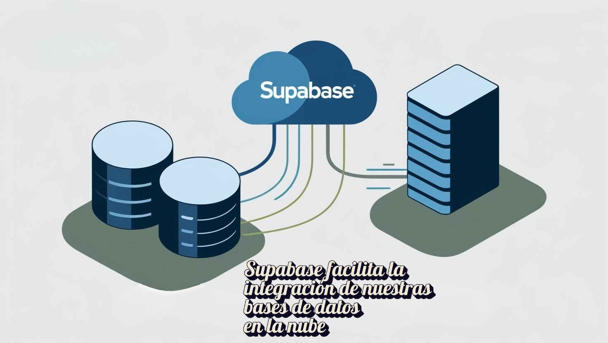
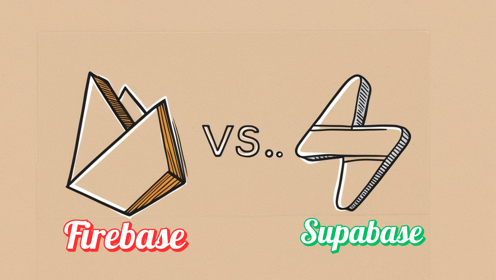
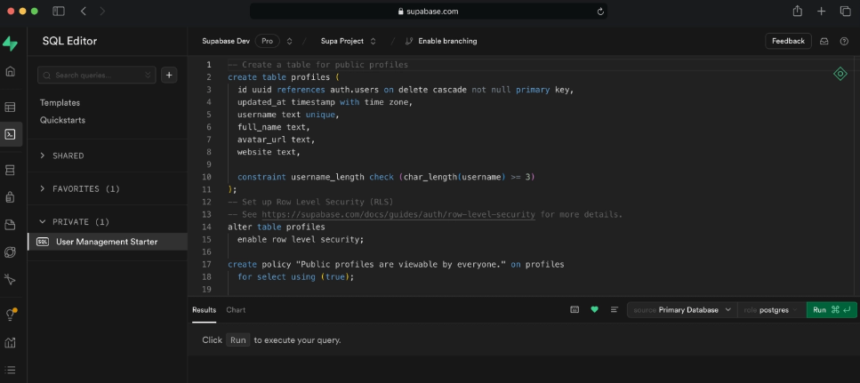
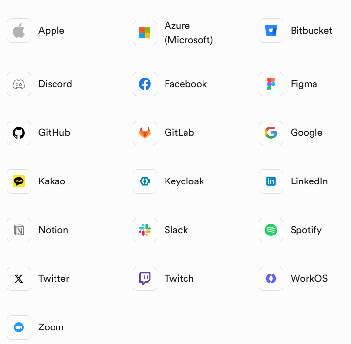

# **Supabase**

   { .center-image }

## **¿Qué es Supabase?** 🎯

Supabase es una plataforma de Backend as a Service (BaaS) basada en la nube que ofrece a los desarrolladores una variedad de herramientas para construir y administrar servicios backend de manera eficiente [2]

Esto permite a los desarrolladores externalizar funciones y acelerar el desarrollo de aplicaciones, sin preocuparse por las tareas del lado del servidor.

   

Supabase se presenta como una alternativa de código abierto a Firebase de Google, destacándose por su interfaz intuitiva. Al estar en la nube, no requiere instalaciones; solo necesitas crear una cuenta para empezar a desarrollar cualquier proyecto.

La plataforma proporciona todas las herramientas y servicios de backend necesarios para crear aplicaciones escalables y seguras, incluyendo gestión de bases de datos, autenticación, almacenamiento de archivos, generación automática de APIs y actualizaciones en tiempo real, entre otros.

## **Ventajas de Supabase** 📈

La facilidad de uso de la interfaz de Supabase puede traducirse en un ahorro significativo de tiempo y costos al desarrollar una aplicación. A continuación, sus ventajas clave:

✅ **Código abierto:**

Se tiene acceso completo al código fuente, por lo tanto, este puede ser personalizado según las necesidades específicas. 

✅ **Comunidad en crecimiento:** 

Cuenta con una comunidad de colaboradores que crece diariamente, donde hay muchos usuarios dispuestos a brindar soporte para encontrar la solución a cualquier problema.

✅ **Base de Datos Relacional Postgres:** 

Supabase usa PostgreSQL, flexible para apps en tiempo real, con buen soporte para consultas complejas e integración de datos.

✅ **Múltiples opciones de implementación:** 

Es posible implementar la aplicación o servicio en la nube de manera muy fácil y rápida a través de su interfaz de línea de comandos o utilizando su panel de control.

✅ **No tiene dependencia del proveedor** 

A diferencia de otros BaaS, que pueden sufrir bloqueos por parte de su proveedor, con Supabase este problema no existe, ya que debido a que es de código abierto, esta no depende de limitaciones de terceros.

## **Supabase como alternativa a Firebase** 🧩

   

Si bien Supabase ofrece funcionalidades similares a Firebase, como alojamiento, autenticación y base de datos en tiempo real, existen diferencias cruciales. Supabase destaca por usar **PostgreSQL**, brindando mayor control de datos con SQL, a diferencia del **NoSQL** menos adaptable de Firebase. Otro punto clave es que Supabase es open source, permitiendo a los desarrolladores modificarlo completamente, algo restringido en Firebase.

Además, Supabase permite desplegar tu propia instancia en la nube (ej: AWS, DigitalOcean), dando control total sobre los datos y costos. Firebase, en cambio, es un servicio completamente gestionado, lo que limita la personalización y encierra al usuario en la infraestructura de Google.

En cuanto a la predicción de costos, Firebase suele volverse costoso a medida que la aplicación escala, especialmente con uso intensivo de bases de datos o almacenamiento. Supabase, al ser autohospedable, ofrece mayor control sobre los gastos operativos. 

En resumen, aunque tanto Supabase como Firebase buscan simplificar el desarrollo backend, sus diferencias fundamentales en la gestión de bases de datos, la filosofía de código abierto y las opciones de despliegue otorgan a Supabase una propuesta de valor distinta, especialmente para aquellos que buscan mayor control, flexibilidad y potencialmente una estructura de costos más predecible a medida que sus proyectos crecen.

## **¿Cómo funciona Supabase?**🛠️

Supabase es una plataforma integral de código abierto que facilita la creación de aplicaciones web y móviles, ofreciendo diversas herramientas de backend listas para usar. Además, utiliza una arquitectura de funciones que se ejecutan en la infraestructura de la nube.

Su sistema de base de datos se basa en **PostgreSQL**, una opción relacional de código abierto reconocida por su fiabilidad y capacidad de crecimiento. A partir de la estructura de estas bases de datos, Supabase genera automáticamente **interfaces de programación (APIs)** de tipo **REST**.

Estas APIs permiten que la aplicación se comunique con la base de datos utilizando formatos comunes como **JSON** o **XML** a través de protocolos web estándar **(HTTP/HTTPS)**. Adicionalmente, proporciona varias formas de autenticar usuarios, como correo electrónico y cuentas de plataformas populares como **GitHub**, **GitLab** o **Google**. También ofrece herramientas para definir permisos de acceso a los datos según el tipo de usuario.

En cuanto a la conexión con otros servicios, Supabase se puede integrar fácilmente con herramientas muy utilizadas como **Stripe** (para pagos), **Slack** y **Discord** (para comunicación) y **GitHub** (para desarrollo), entre otras. Esto permite a los desarrolladores añadir funcionalidades como procesar pagos, enviar notificaciones o configurar alertas en sus aplicaciones sin necesidad de escribir código adicional para estas integraciones.

## **Servicios Ofrecidos**🫴🏼

- **Base de Datos**: 🗂️

Supabase utiliza PostgreSQL, ofreciendo una base de datos relacional potente, con soporte para actualizaciones en tiempo cuasi-real a través de su servicio de **Realtime**. Además, la estructura de las tablas se usa para generar automáticamente una **API REST**, lo que facilita la interacción directa desde el frontend sin necesidad de escribir una capa adicional de backend [4].

   { .center-image }

✔️**Caracteristicas**✔️

❇️ **Vista de Tabla**

No se necesita ser un experto en bases de datos para empezar a usar Supabase. La vista de tabla integrada hace que Postgres sea tan fácil de usar como una hoja de cálculo.

   

❇️ **Editor SQL**

Supabase incluye un Editor SQL. Y a su vez, es posible guardar todas las consultas favoritas para ejecutarlas más tarde.

   

- **Autenticación**: 🆔

Supabase Auth facilita la implementación de autenticación y autorización en las aplicaciones. 
Se proporcionan los SDKs de cliente y puntos de conexión de API para ayudar a crear y administrar a los usuarios [5].

Los usuarios de Supabase pueden usar muchos métodos de autenticación populares, incluyendo contraseña, enlace mágico, contraseña de un **solo uso (OTP)**, inicio de sesión social e inicio de **sesión único (SSO)**.

La autenticación y la autorización son las responsabilidades principales de cualquier sistema de autenticación.

Autenticación significa verificar que un usuario es quien dice ser. ✅👤

Autorización significa verificar a qué recursos se le permite acceder a un usuario. 🔒🔑

Supabase Auth utiliza **JSON Web Tokens (JWTs)** para la autenticación. Auth se integra con las funciones de base de datos de Supabase, lo que facilita el uso de la **Seguridad a Nivel de Fila (RLS)** para la autorización.

A continuación, se muestran las posibles opciones para autenticarse a Supabase a través de otras plataformas sociales como Facebook, GitLab, GitHub, etc.

        

- **Almacenamiento**: 💾

Se puede utilizar Supabase para **guardar  archivos** (como imágenes, videos, documentos, etc.) y para que **estén disponibles** a través de internet [6].

**Supabase Storage** facilita la carga y la entrega de archivos de cualquier tamaño, proporcionando un sistema o framework robusto para controlar el acceso a ellos.

Se puede usar Supabase Storage para almacenar imágenes, videos, documentos y cualquier otro tipo de archivo. Sirve los recursos con una CDN global para reducir la latencia desde más de 285 ciudades en todo el mundo. Supabase Storage incluye un optimizador de imágenes integrado, para hacer posible cambiar el tamaño y comprimir archivos multimedia sobre la marcha.

- **Funciones Edge**: ⚡️

Las Edge Functions son **funciones de TypeScript** que se ejecutan en el servidor, distribuidas globalmente en el **"edge"** (el borde de la red), cerca de los usuarios [7]. Se pueden usar para escuchar webhooks o para integrar el proyecto de Supabase con servicios de terceros como Stripe. Las Edge Functions se desarrollan utilizando Deno, lo que ofrece varios beneficios como desarrollador:

✔️ Son de código abierto.

✔️ Son portables. Las Edge Functions de Supabase se ejecutan localmente y en cualquier otra plataforma compatible con Deno (incluida infraestructura auto-hospedada).

✔️ Prioriza TypeScript y soporta WASM.

✔️ Las Edge Functions están distribuidas globalmente para una baja latencia. 

- **Realtime**: 🔗

Envía y recibe mensajes a clientes conectados [8].

Supabase ofrece un servicio Realtime distribuido globalmente con las siguientes características:

❇️ **Broadcast**

Envía mensajes de baja latencia utilizando las bibliotecas cliente, REST APIs o bases de datos [9].

Se pueden usar las bibliotecas cliente de Supabase para recibir mensajes de Broadcast (difusión).

➡️ **Inicializa el cliente.**

Ir a la Configuración de la API del proyecto de Supabase y obtener la URL y la clave API pública anónima.

                            # Python
                            from supabase import create_client

                            URL = "https://<project>.supabase.co"
                            KEY = "<your-anon-key>"
                            supabase = create_client(URL, KEY)

➡️ **Recibiendo mensajes de Broadcast (difusión).**

Se puede proporcionar una función de devolución de llamada (callback) para el canal de broadcast y así recibir mensajes. Este ejemplo recibirá cualquier mensaje de broadcast que se envíe al canal test-channel:

    # Python

    # Join a room/topic. Can be anything except for 'realtime'.
    my_channel = supabase.channel('test-channel')

    # Simple function to log any messages we receive
    def message_received(payload):
    print(f"Broadcast received: {payload}")

    # Subscribe to the Channel
    my_channel
    .on_broadcast('shout', message_received) # Listen for "shout". Can be "*" to listen to all events
    .subscribe()

➡️ **Enviar mensajes**

Enviar mensajes de Broadcast o difusión usando las bibliotecas cliente.

Se pueden usar las bibliotecas cliente de Supabase para enviar mensajes de Broadcast (difusión).
    
    # Python

    my_channel = supabase.channel('test-channel')

    # Sending a message after subscribing will use Websockets
    def on_subscribe(status, err):
    if status != RealtimeSubscribeStates.SUBSCRIBED:
        return
    my_channel.send_broadcast(
        'shout',
        { "message": 'hello, world' },
    )
    my_channel.subscribe(on_subscribe)

➡️ **Enviar mensajes de Broadcast usando la API REST.**

Se pueden enviar mensajes de Broadcast (difusión) realizando una peticiones HTTP a los servidores Realtime.

    curl -v \
    -H 'apikey: <SUPABASE_TOKEN>' \
    -H 'Content-Type: application/json' \
    --data-raw '{
    "messages": [
        {
        "topic": "test",
        "event": "event",
        "payload": { "test": "test" }
        }
    ]
    }' \
    'https://<PROJECT_REF>.supabase.co/realtime/v1/api/broadcast'

❇️ **Presence**

Comparte el estado entre usuarios con **Realtime Presence** (Presencia en Tiempo Real) [10].

Posibilidad de usar las bibliotecas cliente de Supabase para rastrear el estado de Presencia entre usuarios. 

➡️ **Inicializa el cliente.**

Ir a la Configuración de la API del proyecto de Supabase para obtener la URL y la clave API pública anónima.

    #Python 

    from supabase import create_client

    SUPABASE_URL = 'https://<project>.supabase.co'
    SUPABASE_KEY = '<your-anon-key>'

    supabase = create_client(SUPABASE_URL, SUPABASE_KEY)

➡️ **Sincroniza y rastrea el estado.**

Escucha los eventos de sincronización **(sync)**, unión **(join)** y abandono **(leave)** que se activan cada vez que un cliente se une o abandona el canal, o cambia su porción de estado:

    #Python

    room_one = supabase.channel('room_01')
    room_one
    .on_presence_sync(lambda: print('sync', room_one.presenceState()))
    .on_presence_join(lambda key, curr_presences, joined_presences: print('join', key, curr_presences, joined_presences))
    .on_presence_leave(lambda key, curr_presences, left_presences: print('leave', key, curr_presences, left_presences))
    .subscribe()

➡️ **Enviando estado**

Es posible enviar el estado a todos los suscriptores utilizando **track():**

    # Python

    room_one = supabase.channel('room_01')

    user_status = {
    "user": 'user-1',
    "online_at": datetime.datetime.now().isoformat(),
    }

    def on_subscribe(status, err):
    if status != RealtimeSubscribeStates.SUBSCRIBED:
        return

    room_one.track(user_status)

    room_one.subscribe(on_subscribe)

Un cliente recibirá el estado de cualquier otro cliente que esté suscrito al mismo tema (en este caso, **room_01**). También activará automáticamente sus propios controladores de eventos **sync** y **join.**

➡️ **Dejar de rastrear (Stop tracking)**

Se puede dejar de rastrear la presencia utilizando el método untrack(). Esto activará los controladores de eventos **sync** y **leave.**

    #Python

    room_one.untrack()

➡️ **Clave de presencia (Presence key)**

De forma predeterminada, Presence generará una clave UUIDv1 única en el servidor para rastrear el estado de un canal de cliente. Si se prefiere, es posible proporcionar una clave personalizada al crear el canal. Esta clave debe ser única entre los clientes.

    #Python

    channel_c = supabase.channel('test', {
    "config": {
        "presence": {
        "key": 'userId-123',
        },
    },
    })

❇️ **Cambios Postgres**

Escuchar los cambios de Postgres utilizando **Supabase Realtime.** [11]

En este ejemplo, se configurará una tabla de base de datos, se protegerá con Seguridad a Nivel de Fila (RLS) y la manera de suscripción a todos los cambios será utilizando las bibliotecas cliente de Supabase.

1️⃣ **Configurar un proyecto de Supabase con una tabla 'todos'**

Crea un nuevo proyecto en el Dashboard de Supabase.

Una vez que el proyecto esté listo, crea una tabla en la base de datos de Supabase. Se puede hacer mediante la interfaz de Tabla o el Editor SQL.

    -- SQL

    -- Create a table called "todos"
    -- with a column to store tasks.
    create table todos (
    id serial primary key,
    task text
    );

2️⃣ **Permitir acceso anónimo**

En este ejemplo, se activará la Seguridad a Nivel de Fila para esta tabla y permitiremos el acceso anónimo. En producción, deberemos asegurarnos de proteger las aplicaciones con los permisos apropiados.

    --SQL

    -- Turn on security
    alter table "todos"
    enable row level security;

    -- Allow anonymous access
    create policy "Allow anonymous access"
    on todos
    for select
    to anon
    using (true);

3️⃣ **Habilita la replicación de Postgres**

Ir a la configuración de Publicaciones del proyecto y, debajo de supabase_realtime, y activar los interruptores de las tablas a las que se desea escuchar.

4️⃣ **Instalar el cliente**

Instalar el Cliente Javascript de Supabase

    npm install @supabase/supabase-js

5️⃣ **Crear el cliente**

Este cliente será usado para escuchar a los cambios de Postgres.

    import { createClient } from '@supabase/supabase-js'

    const supabase = createClient(
    'https://<project>.supabase.co',
    '<your-anon-key>'
    )

6️⃣ **Escuchar cambios por esquema**

Escucha los cambios en todas las tablas del esquema **public** estableciendo la propiedad **schema** a **'public'** y el nombre del evento a ***.** El nombre del evento puede ser uno de los siguientes:

    INSERT
    UPDATE
    DELETE
    *

El nombre del canal puede ser cualquier cadena excepto **'realtime'**.

7️⃣ **Insertar datos de prueba**

Ahora es posible agregar algunos datos a la tabla, lo que activará el controlador de eventos **channelA**.

    insert into todos (task)
    values
    ('Change!');

## **Arquitectura de Supabase** 📐

Recordemos que Supabase es de código abierto. Entonces los desarrolladores eligen herramientas de código abierto que son escalables y las hacen fáciles de usar [12].

Supabase no es una réplica exacta de Firebase. Si bien se construyen muchas de las funciones que ofrece Firebase, no lo hacen de la misma manera:
Las elecciones tecnológicas son bastante diferentes; todo lo que usan es de código abierto; y siempre que es posible, utilizan y apoyan herramientas existentes en lugar de desarrollar desde cero.

El objetivo en Supabase es hacer que todo Postgres sea fácil de usar. Eso no significa que se tenga que usarlo todo. Si se es un veterano de Postgres, probablemente  encantarán las herramientas que se ofrecen. Si nunca se ha usado Postgres antes, entonces deberemos comenzar poco a poco e ir creciendo. Si solo se quiere tratar a Postgres como un simple almacén de tablas, está perfectamente bien.

Cada proyecto de Supabase consta de varias herramientas:

        

➡️ **Postgres (como base de datos)**

Postgres es el núcleo de Supabase. No se abstrae la base de datos Postgres; se puede acceder a ella y usarla con privilegios completos. Supabase proporciona herramientas que hacen que Postgres sea tan fácil de usar como Firebase.

    Documentación oficial: postgresql.org/docs
    Código fuente: github.com/postgres/postgres (mirror)
    Licencia: PostgreSQL License - Lenguaje: C

➡️ **Studio (panel de control)**

Un panel de control de código abierto para gestionar las base de datos y servicios.

    Documentación oficial: https://supabase.com/docs
    Código fuente: github.com/supabase/supabase
    Licencia: Apache 2
    Lenguaje: TypeScript

➡️ **GoTrue (Autenticación)**

Una API basada en JWT para gestionar usuarios y emitir tokens de acceso. Se integra con la Seguridad a Nivel de Fila de PostgreSQL y los servidores de la API.

    Documentación oficial: https://supabase.com/docs/reference/self-hosting-auth/start
    Código fuente: github.com/supabase/gotrue
    Licencia: MIT
    Lenguaje: Go

➡️ **PostgREST (API)**

Un servidor web independiente que convierte la base de datos Postgres directamente en una API RESTful.
Lo utilizamos con nuestra extensión pg_graphql para proporcionar una API GraphQL.

    Documentación oficial: postgrest.org
    Código fuente: github.com/PostgREST/postgrest
    Licencia: MIT
    Lenguaje: Haskell

➡️ **Realtime (API y multijugador)**

Un motor WebSocket escalable para gestionar la Presencia de usuarios, la difusión de mensajes y la transmisión de cambios en la base de datos.

    Documentación oficial: https://supabase.com/docs/guides/realtime
    Código fuente: github.com/supabase/realtime
    Licencia: Apache 2
    Lenguaje: Elixir

➡️ **API de Storage (almacenamiento de archivos grandes)**

Un servicio de almacenamiento de objetos compatible con S3 que almacena metadatos en Postgres.

    Documentación oficial: https://supabase.com/docs/reference/self-hosting-storage/start
    Código fuente: github.com/supabase/storage-api
    Licencia: Apache 2.0
    Lenguaje: Node.js / TypeScript

➡️ **Deno (Edge Functions)**

Un entorno de ejecución moderno para JavaScript y TypeScript.

    Documentación oficial: https://docs.deno.com/
    Código fuente: https://github.com/denoland/deno
    Licencia: MIT
    Lenguaje: TypeScript / Rust

